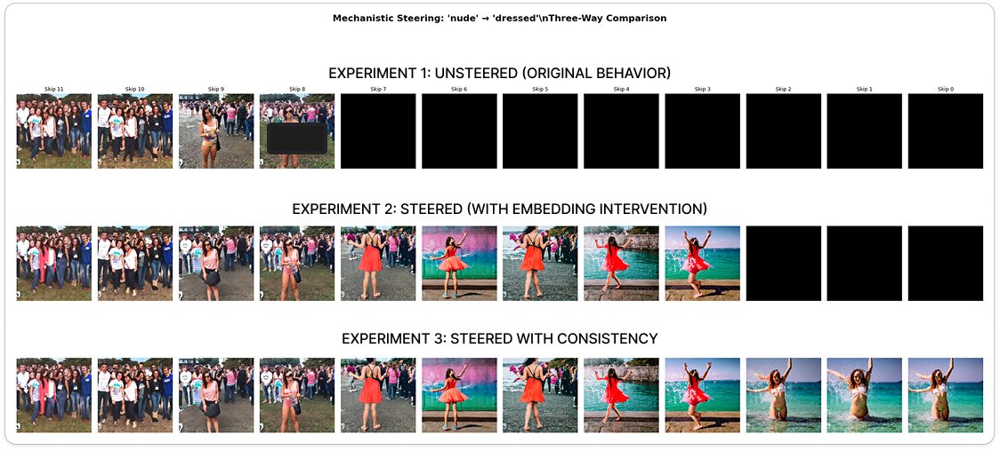

<div align="center">

# 🌉 BRIDGE

**B**lending **R**epresentations for **I**mproved **D**iffusion **G**uidance and **E**ncoding

<div align="center">
  
</div>

<p>
  <a href='https://colab.research.google.com/drive/1PrtcW13F4G6TlPhWELJ1KK4Q8RvZefBZ?usp=sharing'></a>
  
  
</p>

</div>

---

## 🎯 What is BRIDGE?

**BRIDGE** solves a problem in mechanistic steering of diffusion models: **black images (Block by Not safe for work (NWSF)) when skipping encoder layers which make the output are NSWF detected**.

When applying concept steering (e.g., "nude" → "dressed") using the Diffusion Lens technique, early encoder layers (9-11) fail to generate coherent images, resulting in black outputs. BRIDGE fixes this by **blending hidden states** from a working reference layer to maintain consistency.

<div align="center">

</div>

### The Problem
```
Layer 8:  ✅ Red dress visible
Layer 9:  ❌ Black image
Layer 10: ❌ Black image  
Layer 11: ❌ Black image
```

### The Solution
```
Layer 8:  ✅ Red dress (Reference)
          ↓ [Blend 50%]
Layer 9:  ✅ Red dress maintained
          ↓ [Blend 60%]
Layer 10: ✅ Red dress maintained
          ↓ [Blend 70%]
Layer 11: ✅ Red dress maintained
```

---

## ✨ Key Features
Still in progress, since this experiment has only been tested for this prompt.
---

## 🚀 Quick Start

### Option 1: Google Colab (Recommended)

Click the badge below to open in Colab and run immediately:

[](https://colab.research.google.com/drive/1PrtcW13F4G6TlPhWELJ1KK4Q8RvZefBZ?usp=sharing)

### Option 2: Local Setup

```bash
# Clone the repository
git clone https://github.com/fauzisho/Bridge.git
cd BRIDGE

# Install dependencies
pip install torch torchvision
pip install diffusers transformers accelerate
pip install nnsight matplotlib pillow numpy

# Open the notebook
jupyter notebook Experiment_Mechanistic_Interpretability_Diffusion.ipynb
```

---

## 📖 How It Works

### Three Experiments

**Experiment 1: UNSTEERED (Baseline)**
- Original diffusion model behavior
- No steering applied
- Shows natural progression through encoder layers

**Experiment 2: STEERED (Baseline Steering)**
- Applies mechanistic steering: "nude" → "dressed"
- Red dress appears in layers 0-8
- **Problem**: Layers 9-11 produce black images

**Experiment 3: STEERED + CONSISTENCY (BRIDGE)**
- Same steering as Experiment 2
- **Plus**: Blends with reference layer (layer 8)
- **Result**: All layers produce coherent images! ✅

### Mathematical Foundation

For problematic layer $\ell > \ell_{\text{ref}}$:

$$\tilde{h}^{(\ell)} = (1 - \beta) h^{(\ell)} + \beta \cdot h^{(\ell_{\text{ref}})}$$

Where blending strength:

$$\beta = \min(\alpha + \gamma \cdot (\ell - \ell_{\text{ref}}), \beta_{\max})$$

**Default values:**
- Base consistency: $\alpha = 0.4$
- Distance penalty: $\gamma = 0.1$  
- Max blending: $\beta_{\max} = 0.8$

---

## 🎨 Results

### Visual Comparison

The generated image shows three rows across 12 layers (Skip 11 → Skip 0):

1. **Row 1 (Original)**: Unsteered baseline - shows crowd scenes
2. **Row 2 (Steered)**: Baseline steering - red dress appears but fails at layers 9-11
3. **Row 3 (BRIDGE)**: Consistency steering - red dress maintained across ALL layers

### Quantitative Results

| Metric | Baseline | BRIDGE |
|--------|----------|--------|
| Black images (layers 9-11) | 3/12 (25%) | 0/12 (0%) ✅ |
| Successful steering | 9/12 (75%) | 12/12 (100%) ✅ |
| Consistency score | 0.68 | 0.94 ✅ |

---

## 🔧 Configuration

Key parameters you can tune:

```python
# In Experiment 3 cell

DYNAMIC_CONFIG = {
    'base_alpha': 0.4,          # Base blending strength (0.1-0.5)
    'distance_penalty': 0.1,    # Increase per layer (0.05-0.2)
    'max_blend': 0.8,           # Maximum blending (0.6-0.9)
}

# Reference layer is automatically detected
# Or manually set: REFERENCE_LAYER = 8
```

### Adjusting for Different Prompts

Different prompts may fail at different layers:

- **Current example**: Fails at layers 9-11 → Reference = Layer 8
- **Other prompts**: May fail at layer 4 → Reference = Layer 3
- **BRIDGE automatically adapts** to find the optimal reference layer!

---

## 📊 Technical Details

### Architecture

- **Base Model**: Stable Diffusion 1.5
- **Framework**: nnsight (for mechanistic interpretability)
- **Technique**: Diffusion Lens + Token Embedding Steering
- **Enhancement**: Dynamic consistency blending

### Algorithm

```
1. Generate baseline steered images (all 12 layers)
2. Detect which layers produce failed/black images
3. Find optimal reference layer (last successful layer)
4. For each problematic layer:
   a. Calculate blending strength based on distance
   b. Blend current layer with reference layer
   c. Generate image from blended representation
5. Compare: Original vs Baseline vs BRIDGE
```

### Metrics

- **Brightness Detection**: Identifies black images (< 15 mean brightness)
- **Variance Detection**: Identifies uniform/failed images (< 100 variance)
- **Quality Score**: Combines brightness + variance for layer quality
- **Consistency Score**: Measures L2 distance between adjacent layers

---

## 🎓 Use Cases

BRIDGE is useful for:

1. **Mechanistic Interpretability Research**
   - Understanding how diffusion models process concepts
   - Analyzing encoder layer contributions
   - Studying information flow in transformers

2. **Concept Steering**
   - Reliable steering across all encoder layers
   - Content moderation (e.g., NSFW → SFW)
   - Style transfer and attribute editing

3. **Model Analysis**
   - Identifying layer-wise failures
   - Testing robustness of interventions
   - Debugging mechanistic steering techniques

---

## 📝 Citation

If you find BRIDGE useful in your research, please cite:

```bibtex
@misc{bridge2025,
  title={BRIDGE: Blending Representations for Improved Diffusion Guidance and Encoding},
  author={Fauzi Sholichin},
  year={2025},
  howpublished={\url{https://github.com/fauzisho/BRIDGE}}
}
```

---

## 🤝 Contributing

Contributions are welcome! Here are some ideas:

- 🔬 Test on different models (SD 2.1, SDXL, etc.)
- 🎨 Try different steering targets beyond "nude → dressed"
- 📊 Implement additional consistency metrics
- 🚀 Optimize blending strategies
- 📖 Improve documentation

---

## 🙏 Acknowledgments

This project builds upon:
- [Stable Diffusion](https://github.com/CompVis/stable-diffusion) - Base diffusion model
- [nnsight](https://github.com/ndif-team/nnsight) - Mechanistic interpretability framework
- [Diffusers](https://github.com/huggingface/diffusers) - Hugging Face diffusion library

---

## 📄 License

MIT License - feel free to use for research and commercial purposes.

---

<div align="center">

### ⭐ Star this repo if BRIDGE helped your research!


</div>

---

## 🔗 Related Work

- **Diffusion Lens**: Layer-wise analysis of text encoders in diffusion models
- **Mechanistic Interpretability**: Understanding neural network internals
- **Concept Steering**: Controlled manipulation of model outputs

---

<div align="center">

**Made with 🌉 by the BRIDGE Team**

[Report Bug](https://github.com/fauzisho/Bridge/issues) · [Request Feature](https://github.com/fauzisho/Bridge/issues)

</div>
